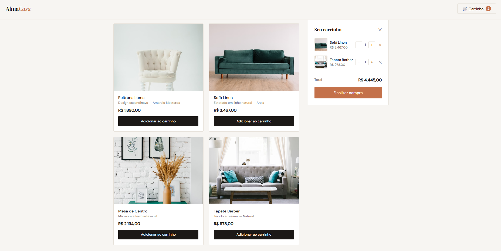

# React Shopping Cart — Alma Casa

Carrinho de compras interativo construído com React, sem nenhum framework ou bundler — apenas React via CDN com Babel standalone.

## O que foi feito
- Listagem de produtos com imagem, descrição e preço
- Adicionar ao carrinho com feedback visual no botão
- Painel lateral do carrinho com controle de quantidade
- Remoção de itens e total calculado em tempo real
- Persistência do carrinho com localStorage
- Gerenciamento de estado com useState e useEffect
- Layout responsivo

## Tecnologias
React 18 · JavaScript (JSX) · CSS

## Demo
🔗 [Ver online](https://elizandrasouzadev.github.io/react-shopping-cart)

## Preview

